# 🚀 GTen

> **개발 기간:** 2023.11 ~ 2023.12 (2개월)<br>
> **개발 형태:** 팀 프로젝트(3인)<br>
> **사용 기술:** Unity 2022.3, C#<br>
> **그래픽 툴:** MagicalVoxel, Aseprite<br>
> **시연 영상:** <https://youtu.be/-ZwJhN842nM><br>

지구를 탈출하여 우주로 올라가는 여정을 담은 **3D 캐주얼 플랫폼 게임**입니다. 3인 팀 프로젝트에서 플레이어 코어 조작, Cinemachine 기반 시점 제어, 다양한 동적 지형 기믹 및 적 AI 시스템을 구현하여 플랫폼 게임의 핵심 플레이 루프를 안정적으로 구동하는 것에 집중했습니다.

---

## 🛠 담당 역할

### Player

* Rigidbody 기반 플레이어 이동 및 점프
* 공격 시스템 구현
* HP 및 피격 처리
* Cinemachine 기반 3인칭 카메라
* 애니메이션 상태 연동

### AI

* NavMesh 기반 PolarBear AI
* 플레이어 추적 및 공격
* 눈덩이 투사체 공격
* 레벨에 따른 공격 활성화 제어

### Environment

* 일정 시간 후 사라지는 발판
* 이동 플랫폼

### UI

* 게임 시작
* 오프닝
* 엔딩
* 게임 오버 UI

### Art

- MagicaVoxel을 활용한 2, 3레벨 맵 제작
- Aseprite를 활용한 UI 및 게임 로고 제작
- 스테이지 레벨 디자인 기획안 제작

---

## 🎨 게임 플레이 및 레벨 디자인

프로젝트 초기 단계에서 직접 구상한 **전체 스테이지 동선 기획안**과 실제 `MagicalVoxel`을 활용하여 제작 및 구현한 **레벨 2(숲 지형) 및 레벨 3(눈 지형)**의 인게임 스크린샷입니다.

### 1. 레벨 디자인 기획 초안

플레이어가 최하단 바다에서 시작하여 최상단 우주(행성)까지 도달하는 종스크롤 플랫폼 동선과 레벨별 기믹 배치를 설계한 초안입니다.
<br>
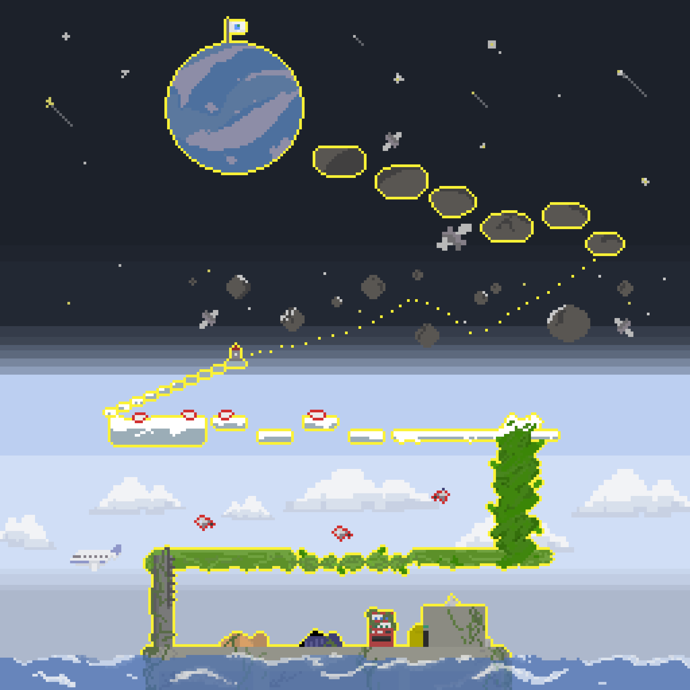

### 2. 레벨 2 (숲 지형) 구현 화면

모듈형 나무 발판 에셋을 제작하고 배치했으며, 플레이어가 밟으면 시간 차를 두고 소멸하는 `DisappearLeaves.cs` 기믹을 적용한 구역입니다.
<br>
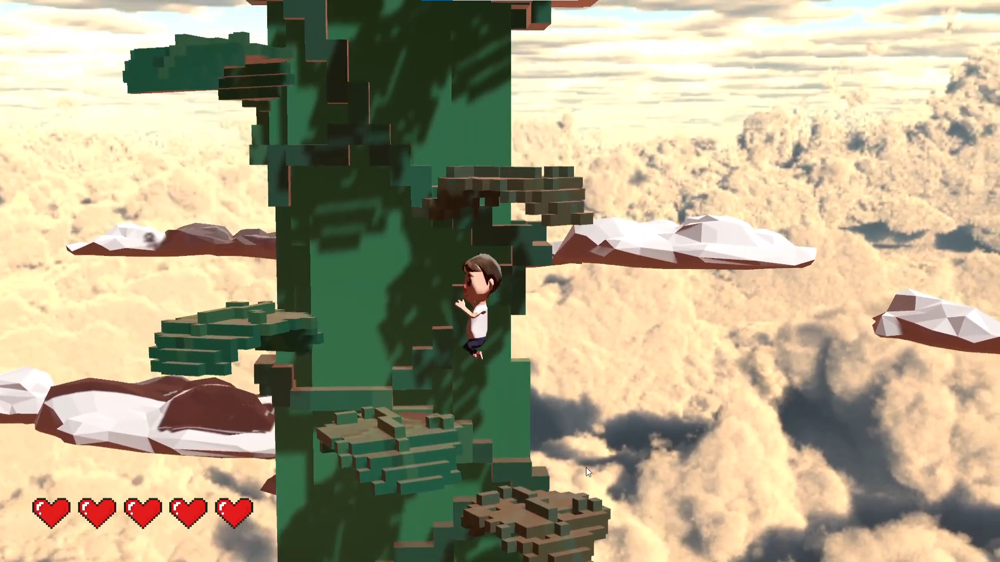

### 3. 레벨 3 (눈 지형) 구간별 구현 화면

주기적으로 왕복하는 무빙 플랫폼 기믹(`MoveBlock.cs`)과 런타임 투사체 제어 플래그(`ThrowActiveTrue.cs`)를 적극 활용하여 조작 변수를 극대화한 스테이지입니다.

| 레벨 3-1: 무빙 플랫폼 탑승 | 레벨 3-2: 적 AI 및 NPC 배치 구역 | 레벨 3-3: 적 AI와의 상호작용 |
| :---: | :---: | :---: |
| 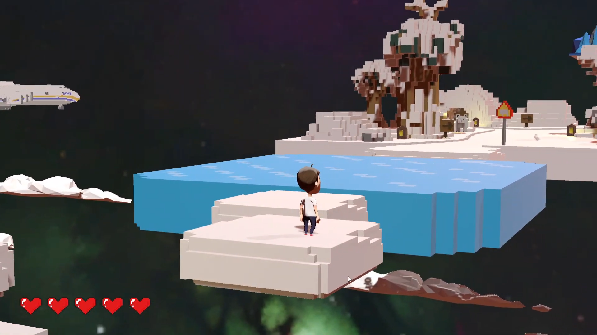 | 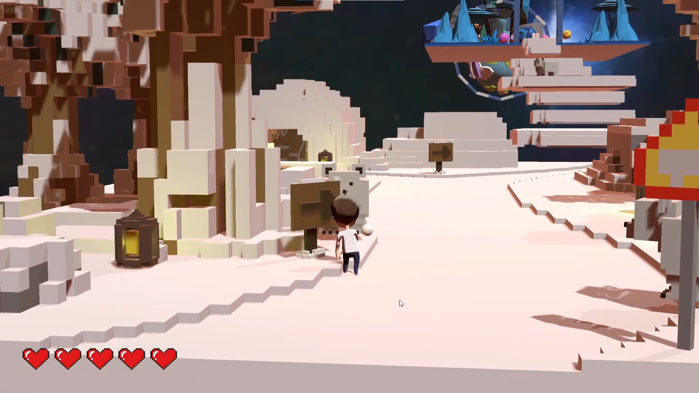 | 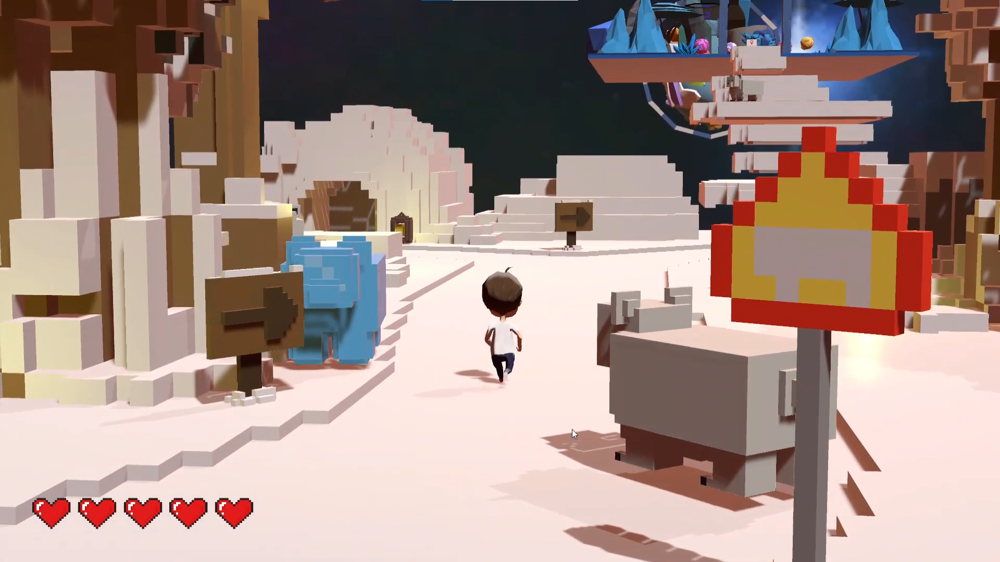 |

---

## 📂 프로젝트 구조

제가 담당한 기능은 기능별 폴더로 분리하여 관리했습니다.

```text
Scripts
├── AI (적 AI 및 공격 제어)
│   ├── PolarBear.cs            # 백곰(적) AI 추격 및 피격
│   ├── PolarBearAttack.cs      # 백곰(적) 근접 공격
│   ├── Snow.cs                 # 적 투사체 오브젝트
│   ├── ThrowActiveFalse.cs     # 투사체 공격 비활성화 제어
│   └── ThrowActiveTrue.cs      # 투사체 공격 활성화 제어
│
├── Camera
│   ├── VirtualCamera.cs        # 시네머신 가상 카메라 속성 제어
│   └── CameraActive.cs         # 구역 진입 시 카메라 트래킹 리셋 예외 처리
│
├── Environment (동적 환경 기믹)
│   ├── DisappearLeaves.cs      # 레벨 2: 시간 차 소멸 발판
│   └── MoveBlock.cs            # 레벨 3: 왕복 이동 플랫폼 (물리 동기화)
│
├── Player (플레이어 및 시점 제어)
│   ├── Player.cs               # 입력 폴링, 이동/회전/점프 물리, 피격 및 사망
│   └── ThrowSnow.cs            # 플레이어 원거리 눈 던지기 액션 트리거
│
├── UI
│   └── GameUI.cs               # 전체 세션(시작, 프롤로그, 엔딩, 오버) 및 하트 HP 연동
│
└── Other Scripts (Team Members)
```

> AI, Player, Environment, UI 폴더의 스크립트는 직접 구현하였으며, 그 외 기능은 팀원들이 담당했습니다.


--- 

## 🖥 UI

`Aseprite`를 활용하여 타이틀 로고, 프롤로그 연출, 하트 HP 인터페이스 및 게임 오버/엔딩 화면 전반을 직접 도트 그래픽으로 제작하고 제어했습니다.

### 1. 게임 시작 화면

도트 디자인의 게임 로고와 메인 로켓 오브젝트, 정돈된 타이틀 메뉴 버튼 UI입니다.
<br>
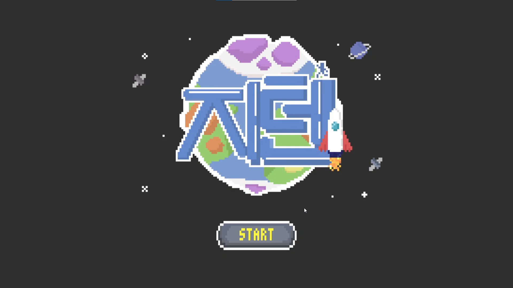


### 2. 스토리 오프닝 프롤로그

지구를 탈출해야 하는 긴급한 상황을 연출하였습니다.

| 프롤로그 1: 스토리 시작 | 프롤로그 2: 지구의 멸망 | 프롤로그 3: 타이틀 미션 개방 |
| :---: | :---: | :---: |
| 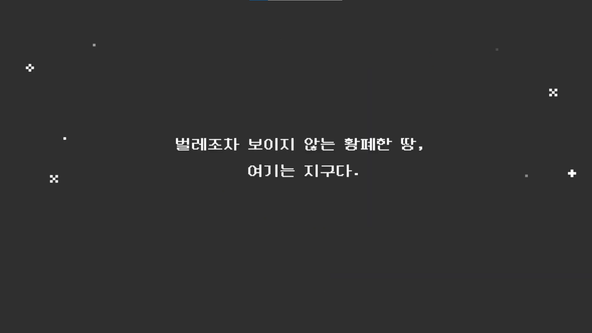 | 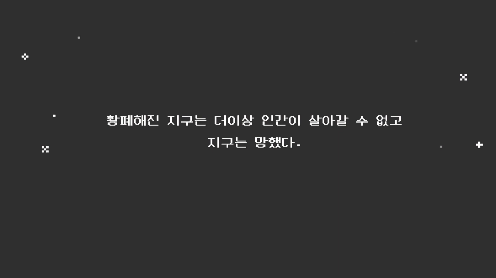 | 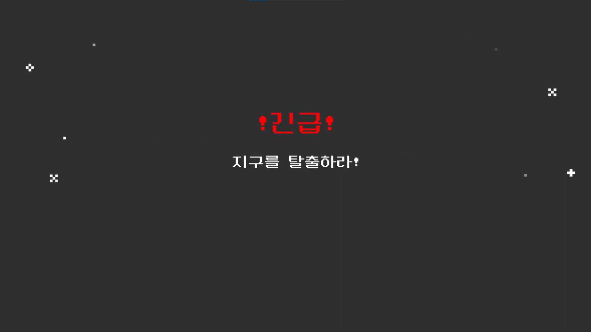 |


### 3. 플레이어 HP

플레이어 캐릭터의 생명 수치를 실시간 동기화하여 시각 피드백을 전달하는 도트 하트 GUI 컴포넌트입니다.
<br>
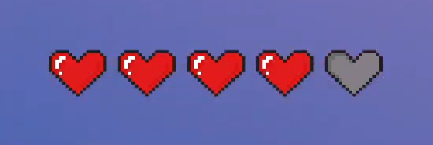

### 4. 세션 종료 화면

플레이어가 사망했을 때의 게임 오버 재시작 루프와 최종 목적지 도달 시 팀원 명단 및 도착 메시지가 출력되는 엔딩 스크린 인터페이스입니다.

| 게임 오버 및 재시작 (GameOver) | 최종 행성 도달 (Ending) |
| :---: | :---: |
| 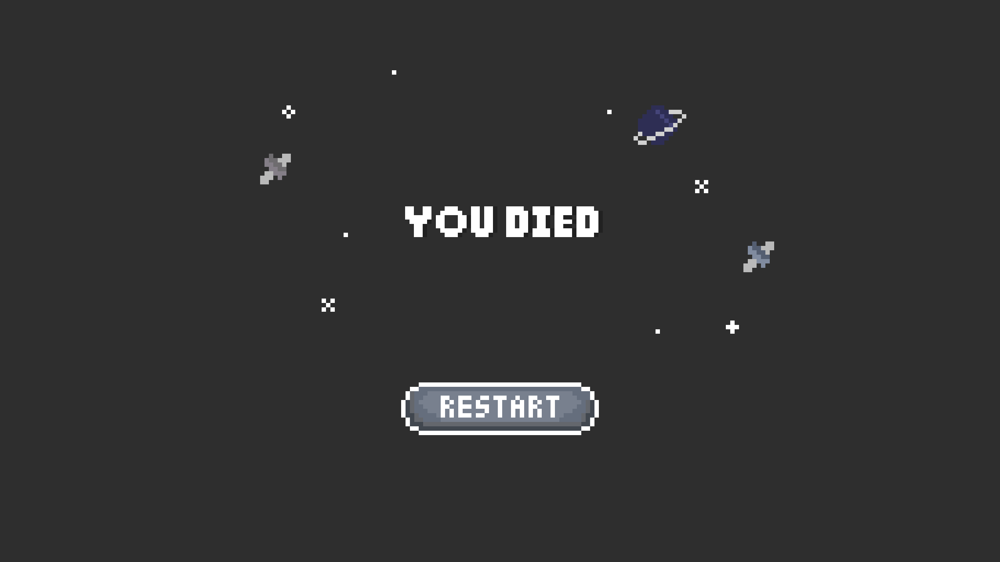 | 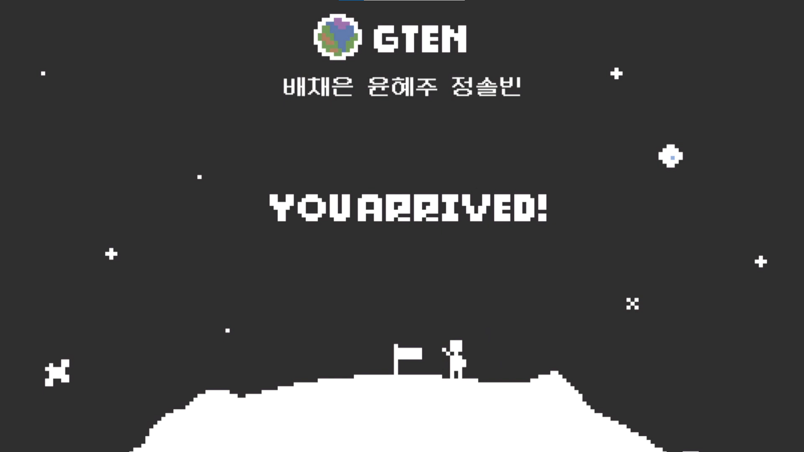 |

---

## 💡 기술적 문제 해결

### 1. 무빙 플랫폼 탑승 시 플레이어 미끄러짐(위치 미동기화) 현상 해결
* **문제 상황:** 레벨 3 눈 스테이지에서 주기적으로 왕복 이동하는 플랫폼(`MoveBlock.cs`) 구동 시, 플레이어가 플랫폼 위에 착지했음에도 불구하고 발판의 이동 속도를 따라가지 못하고 뒤로 밀려 추락하는 조작 오차가 발생했습니다.
* **원인 분석:** 플레이어와 무빙 플랫폼 오브젝트가 유니티 런타임 상에서 서로 독립적인 트랜스폼(Transform) 좌표 연산을 수행하고 있어 논리적 동기화가 이루어지지 않았습니다. 물리 엔진의 단순 마찰력 연산만으로는 플랫폼의 동적 변위 벡터를 실시간으로 상속받지 못하는 엔진 구조적 한계였습니다.
* **해결 과정:** 매 프레임 좌표를 강제로 동기화하는 무거운 연산 대신, 유니티의 **Transform 계층 구조(Parenting)**를 활용하여 논리적 물리 동기화를 구현했습니다.
  * `OnTriggerEnter` 를 통해 객체가 플랫폼의 트리거 영역에 진입하면, `other.transform.SetParent(transform)`를 호출하여 플레이어를 플랫폼의 자식 객체로 즉시 편입시켰습니다. 이를 통해 자식 오브젝트(플레이어)가 부모 플랫폼의 X축 변위 이동 벡터를 그대로 공유하도록 처리했습니다.
  * 플랫폼 영역을 벗어나는 `OnTriggerExit` 시점에는 `SetParent(null)`을 호출하여 부모 관계를 해제함으로써, 독립적인 월드 좌표계 상의 물리 상태로 복원시켰습니다.
* **결과:** 발판의 움직임과 탑승한 플레이어의 좌표가 100% 일치하게 되어 속도 차이로 인한 미끄러짐이나 추락 현상이 해결되었습니다.

<details>
<summary>트리거 기반 부모-자식 계층 구조(Parenting) 동기화 소스 코드 보기</summary>

```csharp
private void OnTriggerEnter(Collider other)
    {
        other.transform.SetParent(transform);
    }

    private void OnTriggerExit(Collider other)
    {
        other.transform.SetParent(null);
    }

```
</details>

---

## 🚀 회고 및 성장

GTen은 Unity로 진행한 첫 팀 프로젝트였습니다.

개인 프로젝트와 달리 다른 팀원과 협업하여 기능을 통합하는 과정을 경험했고 기능 구현뿐 아니라 **역할 분담과 커뮤니케이션의 중요성**을 배울 수 있었습니다. 또한 플레이어, AI, 환경 기믹을 구현하면서 컴포넌트 간 의존성이 증가하는 문제를 경험했고, 이후 프로젝트에서는 이를 개선하기 위해 구조 설계에 더 많은 관심을 가지게 되었습니다.

이 경험은 다음 프로젝트인 **[Shadow of the Dragon](https://github.com/solbinjung/unity-shadow-of-the-dragon)** 에서 ScriptableObject 기반 데이터 관리와 중앙 매니저 구조를 설계하는 기반이 되었으며, 이후 **[Project WHISPER](https://github.com/solbinjung/ue5-project-whisper)** 에서는 Gameplay Framework를 활용한 시스템 설계로 이어졌습니다.
